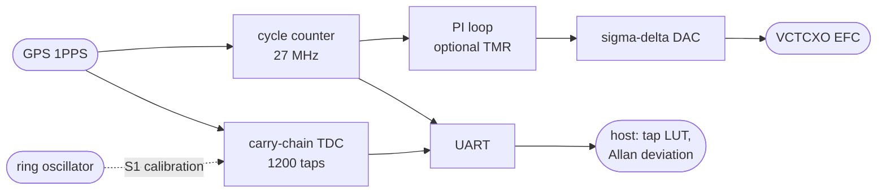

# FPGA GPS Clock

[](LICENSE)

A GPS-disciplined clock with a picosecond time-to-digital converter on a £15 Sipeed Tang Nano 9K (Gowin GW1NR-9C), built only with open source tools (yosys, nextpnr, apicula, cocotb and SymbiYosys). Made by Krystian Filipek.

<div align="center">


</div>

## Features

### Measured Performance
| Measurement | Result |
|-------------|--------|
| TDC step, median | 24.6 ps, from the adder carry chain |
| Single-shot precision | ~31 ps rms per channel |
| Crystal stability vs GPS | 11.2 ppb at 1 s, 2.65 ppb floor |
| Radio carrier | ±0.21 Hz at 433.92 MHz, no spectrum analyser |
| Upset hardening | 130 of 200 bit flips break lock, 0 with TMR |
| Verification | Formal proofs, 48 cocotb tests, CI on every push |

### Designs
- **gpsdo** - The clock: carry-chain TDC, ring oscillator calibration, GPS cycle counter and PI discipline loop
- **extras/ticprec** - The TDC's single-shot precision, one edge timed on two chains
- **extras/xocal** - A CC1101 radio's crystal measured against the clock
- **extras/radio433** - 433 MHz receiver, decoded in fabric and stamped with GPS time
- **docs** - Spec sheet, measurements, verification and roadmap

### Signal Flow


Where both chains land in ordinary taps the spread is ~31 ps per channel; where the carry crosses a fabric column one tap is 5 ns wide. Against GPS, the TDC halves the 1 s figure and what is left is the GPS module's own pulse jitter. Every number and the capture behind it is in [docs](docs/README.md).

## Getting Started

### Prerequisites
- **Linux x64** with `git`, `curl` and `make`
- **Sipeed Tang Nano 9K** board
- **GPS module with a 1PPS output** (tested with a u-blox NEO-M8N)

### Building the Project
1. Clone the repository:
   ```bash
   git clone https://github.com/kfilipekk/fpga_gps_clock.git
   cd fpga_gps_clock
   ```

2. Install the toolchain into `tools/` (nothing is installed globally):
   ```bash
   ./setup.sh
   source tools/oss-cad-suite/environment
   ```

3. Build, test and flash:
   ```bash
   make -C gpsdo          # bitstream
   make -C gpsdo sim      # cocotb
   make -C gpsdo lint     # verilator
   make -C gpsdo formal   # symbiyosys
   make -C gpsdo flash    # load over usb
   ```

Each design has `rtl/`, `sim/`, `host/` for the Python that reads its serial output, and `formal/` where it has proofs. Top level port names must match `mk/tangnano9k.cst`; extra pins go in a design's own cst, named by `CST_EXTRA`.

## Applications

I made this project to explore:
- Sub-nanosecond timing on cheap FPGA fabric
- GPS discipline loops and Allan deviation
- Formal verification and cocotb testing in an open source flow
- Timestamping radio signals against GPS

## Future Plans

- GPS sawtooth correction from the M8N's qErr
- Close the loop with a VCTCXO on the EFC pin
- Doppler orbit determination from a recorded satellite pass with an RTL-SDR

<div align="center">

Developed by [kfilipekk](https://github.com/kfilipekk)

</div>
