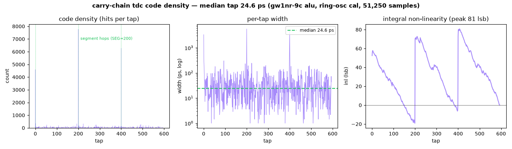
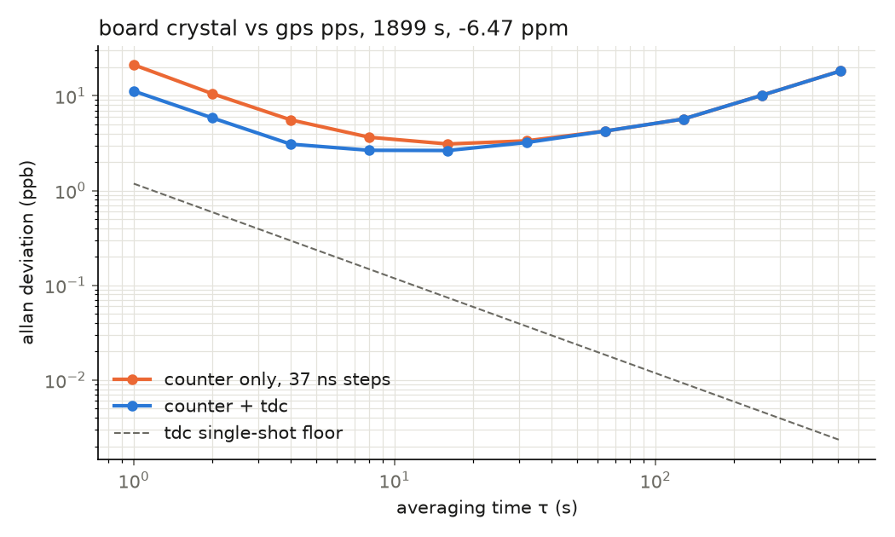

# Docs

What is measured, how it is checked and what comes next. Every figure is
measured on the board unless stated otherwise.

[Spec sheet](#spec-sheet) · [Measurements](#measurements) ·
[Verification](#verification) · [Roadmap](#roadmap) ·
[Multi-node plan](#multi-node-plan) · [Reproduce](#reproduce)

## Spec Sheet

The carry-chain TDC and the clocks around it, on a Gowin GW1NR-9C (Tang
Nano 9K) with the open source flow.

| TDC | value | notes |
|---|---|---|
| clock | 27 MHz board crystal | -6.47 ppm against GPS |
| chain | 1200 ALU taps, 6 segments of 200 | [tdc_chain.v](../gpsdo/rtl/tdc_chain.v) |
| tap, median | 24.6 ps | 51,250 ring samples, 22.8 to 25.7 ps across placements |
| mean bin | 62 ps | ~600 codes span one 37 ns clock |
| DNL / INL | +89 / -1 LSB, 81 LSB peak | the segment hops, calibrated out by the LUT |
| single-shot quantisation | 837 ps rms | dominated by the wide hop bins |
| wave union | 778 → 575 ps quantisation | best single chain vs two summed, same edges |
| single-shot precision | ~31 ps rms per channel, 1.4 ns in a hop bin | one edge on two chains, 72k edges |
| dead time | 44 µs | the snapshot shifts out one tap a clock |
| calibration | ring oscillator code density | no GPS or external source |

| Instruments | value | notes |
|---|---|---|
| time interval counter | 2 channels, 32-bit coarse (159 s range) | 43% LUT, 38% ALU, 126 MHz |
| Allan deviation, 1 s | 11.2 ppb with the TDC, 21.2 ppb count only | 1,899 s run |
| Allan deviation floor | 2.65 ppb at 8 to 16 s | crystal wander above ~30 s |
| GPS PPS jitter | 6.5 ns rms per edge | NEO-M8N sawtooth |
| frequency transfer | CC1101 carrier to ±0.21 Hz at 433.92 MHz, 300 s | [xocal](../extras/xocal/README.md) |
| radio packet stamp | per-packet UTC, to one 37 ns clock for now | [radio433](../extras/radio433/README.md) |

Limits:

- The hops dominate. A third of edges land in a 4 to 6 ns hop bin, and
  wave union only shrinks a hop where the other chain's taps are fine.
- In the two-channel build one chain reads a clock late and saturates a
  third of the time. The cause is unconfirmed
  ([ticprec](../extras/ticprec/README.md)).
- 1 s stability is set by the GPS pulse (6.5 ns), not the TDC (~30 ps).
- The discipline loop is proven in simulation only, until a VCTCXO is
  wired.

## Measurements

### TDC Tap Linearity

The gpsdo bitstream in ring oscillator calibration mode (S1). The ring is
asynchronous to the crystal, so its edges land evenly over the 37 ns clock
period, and a histogram of where they land gives the width of every tap.
The spikes are the segment hops at taps 0, 200 and 400, where the carry
crosses a fabric column and one tap covers ~5 ns. The per-tap table is the
calibration LUT: raw code in, picoseconds out.

### Allan Deviation, Count vs TDC

1,899 s of unbroken GPS PPS, then 60,081 ring samples in the same capture,
so the LUT is taken minutes after the PPS it corrects. Each interval is the
clock count less this edge's tap delay plus the last one's.

| τ | count only | count + TDC |
|---|---|---|
| 1 s | 21.2 ppb | **11.2 ppb** |
| 4 s | 5.6 ppb | 3.1 ppb |
| 16 s | 3.1 ppb | **2.65 ppb** |
| 64 s | 4.2 ppb | 4.2 ppb |
| 512 s | 18.3 ppb | 18.3 ppb |

The TDC halves the 1 s figure, and what is left is the GPS. The TDC's own
quantisation is 1.2 ppb on a 1 s interval, while the M8N's pulse jitters
6.5 ns rms per edge. That fits the sawtooth of the receiver snapping its
pulse to its own clock (a uniform ±10.4 ns would give 6.0 ns).
UBX-TIM-TP qErr reports that offset for each pulse, so subtracting it is
the next improvement. Past ~30 s the curves merge and climb as the crystal
warms and wanders, which is what the discipline loop and a VCTCXO are for.

## Verification

CI runs lint, simulation, formal, a bitstream per design and the host
tests on every push.

| Layer | What | How |
|---|---|---|
| lint | verilator -Wall on every top and library module | `make lint` |
| simulation | 48 cocotb tests over 29 RTL modules, all but the two silicon-only delay lines | `make sim` |
| formal | SymbiYosys, two unbounded proofs and one bounded check | `make formal` |
| upsets | bit flip campaign on the discipline loop | `make -C gpsdo/sim disc_loop_seu disc_loop_seu_tmr` |
| host | 45 tests on the analysis code, synthetic captures with known answers | `python3 */host/test_*.py` |

- **uart_tx, proved.** Every accepted byte comes out as start, 8 data bits
  LSB first and stop, DIV clocks each, idle high otherwise. k-induction.
- **spi_cfg, proved.** SPI mode 0 for any MISO, mode and start: SCK is low
  whenever CSN is high, MOSI never changes on the clock SCK rises, and done
  is only raised with the chip deselected. Induction needed per-state
  invariants inside the module.
- **uart_tx into uart_rx, bounded.** Every byte sent comes out once,
  unchanged, and nothing comes out that was not sent. 160 clocks, four
  back-to-back frames.

Each property was checked against a planted bug first (MSB-first TX, MOSI
moving with SCK, MSB-first RX), and all three fail.

**Upsets.** 200 random bit flips in the locked loop: 130 leave the plain
loop out of lock, none the triplicated one
([gpsdo](../gpsdo/README.md#single-event-upsets)).

**What simulation cannot see.** The carry chains and ring oscillator are
zero-delay stubs in simulation and are characterised on silicon. That gap
showed twice: a TDC trigger change passed every test and hung on the
board, and the TMR merge only showed in the synthesis stats.

## Roadmap

Needs wiring or a part:

1. **GPS sawtooth correction.** gpsdo/host/ubx.py already reads qErr.
   Route the M8N's TX to a spare FPGA pin and forward it on the FPGA's
   UART, which should take most of the 6.5 ns off the 1 s figure.
2. **Close the loop.** The PI loop and sigma-delta DAC are proven in
   simulation. A ~£5 VCTCXO on the EFC pin locks the -6.47 ppm crystal.
3. **Speed of light in coax.** One output, two cable lengths, two TIC
   inputs, giving the velocity factor to a few mm.
4. **Interleave the hops.** Place the two chains so their hops fall at
   different phases, so wave union removes the wide bins.
5. **LoRa CubeSats (stretch).** SX1278 and an ESP32, per-packet frequency
   error corrected the xocal way and stamped by rf_stamp.

With an RTL-SDR:

6. **Doppler orbit determination**, the main goal. Record a pass (Meteor-M
   at 137.9 MHz or a CubeSat beacon at 435 to 438 MHz) with a GPS-referenced
   FPGA pilot tone, fit the time and range of closest approach with a UKF
   and compare against the published orbit.
7. **GRAVES space radar.** The 143.05 MHz CW illuminator needs no
   reference channel, giving UTC-stamped meteor and satellite echoes to
   check against SGP4.
8. **SDR as ground truth.** Measure the calibrated CC1101 carrier
   independently, and record GPS L1 IQ for a fabric correlator.

Later, the multi-node plan below.

## Multi-node Plan

Receivers at known positions r_i timestamp the same signal against a
common clock. Each pair gives a hyperboloid,

    (t_i - t_j) * c = |p - r_i| - |p - r_j|

so three receivers give a 2D fix and four give 3D, without knowing the
transmit time. Light moves 30 cm/ns, so a metre needs the nodes to agree to
a nanosecond. The GPS epoch, the discipline loop, the ~31 ps TDC and
tic/rf_stamp already provide that per node; correlation and the solve stay
on the host.

Phases: two boards on one GPS with their PPS phase difference measured,
then two nodes and a known 433 MHz beacon checked against the geometry,
then four or more nodes and a moving transmitter. The picoseconds are
clock alignment; position accuracy is set by bandwidth, SNR, geometry and
multipath.

## Reproduce

    stty -F /dev/ttyUSB1 115200 raw -echo

    #tdc code density, gpsdo bitstream in s1 calibration mode
    timeout 60 cat /dev/ttyUSB1 > taps.txt
    python3 gpsdo/host/tdc_cal.py taps.txt

    #allan deviation, gpsdo bitstream: ~30 min of pps, then s1 for a minute
    python3 gpsdo/host/pps_adev.py run.txt --png adev.png

    #single-shot precision, ticprec bitstream, no wiring
    python3 extras/ticprec/host/tic_prec.py tic.txt --png precision.png
