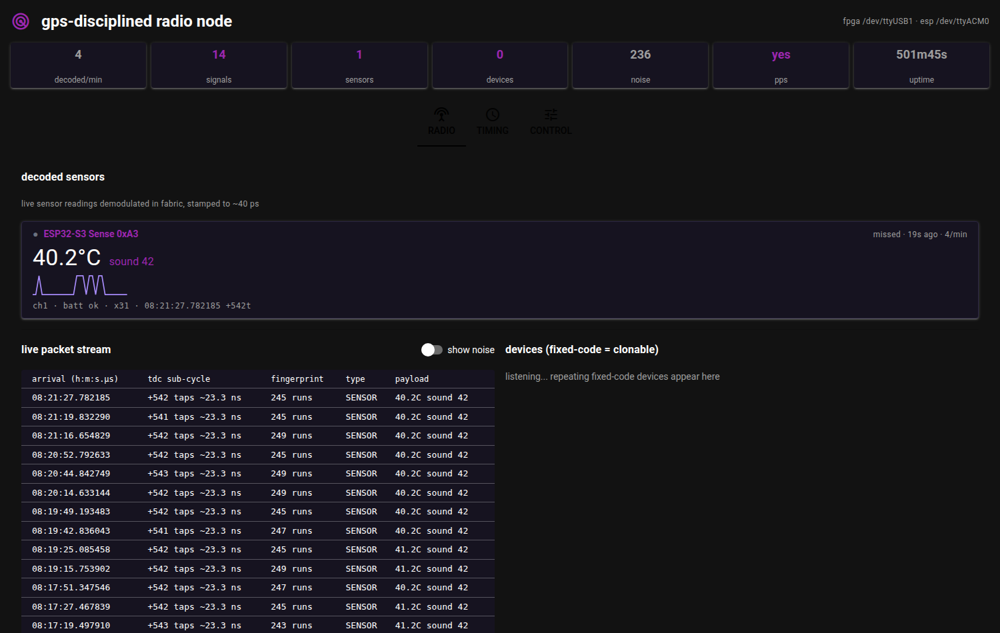
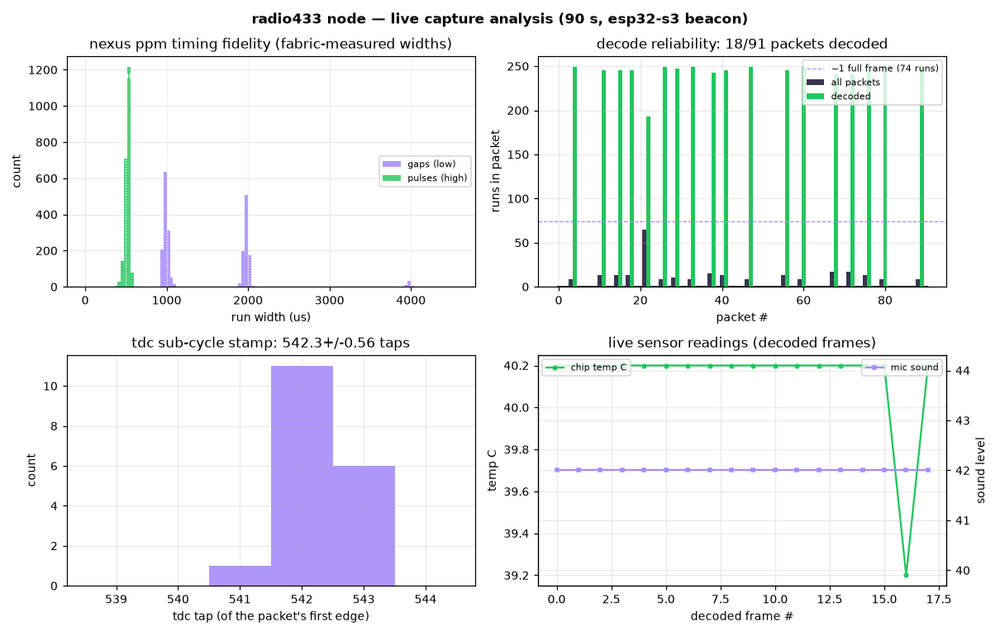

# radio433

A 433 MHz OOK receiver built on the gpsdo timing core. A CC1101 in
asynchronous raw mode hands the FPGA the sliced envelope on one pin; the
FPGA demodulates, decodes and timestamps it, and streams packets to the
host.

The dashboard decoding an ESP32 sensor beacon live, each packet stamped
against GPS time.

## How It Works

- **Radio setup.** spi_cfg writes the CC1101's asynchronous OOK 433.92 MHz
  register set at power-up and strobes RX, so the FPGA sets up its own
  radio with no microcontroller.
- **Demodulation.** glitch_filt rejects sub-symbol blips and fills short
  dropouts. ook_rx measures every high and low run in clock cycles and
  frames packets on the quiet gaps.
- **Bit recovery**, chosen at build time: pwm_slice for pulse-width devices
  (weather stations, TPMS, remotes), nrz_sample for a CC1101 in packet mode,
  manch_decode for biphase. sync_frame correlates the sync word and
  collects the payload, optionally only when its CRC-8 checks.
- **Buffering.** Runs go into block RAM as they arrive and are sent over
  the UART in the idle gap, so the slow UART never drops a run mid-burst.
  Each packet is a header `@ssssssss uuuuuuuu fff` (second, clock cycles
  into the second, TDC code), `D<hex>` when the sync matched, then one
  `RLwwwwww` line per run.
- **Timestamping.** rf_stamp tags the first edge with UTC from the
  gpsdo's TDC. glitch_filt re-times the edge first, so for now a packet is
  placed to one 37 ns clock. The gpsdo's PPS line rides the same UART.
- **Transmit.** GDO0 is bidirectional. A host `T` switches the CC1101 to TX
  and replays the last packet out of the same pin, an exact copy since the
  widths are already in clock cycles. `C` transcodes instead: nexus_decode
  recovers the 36-bit frame and nexus_encode re-emits it with clean timing.

47% of the LUTs, two block RAMs, 76 MHz.

## Why Raw OOK and Fabric Decode

Packet mode only decodes CC1101-framed packets. Raw OOK hands the FPGA
every edge, so it can decode and stamp any OOK device. The cost is no
processing gain: with no signal the AGC turns up until GDO0 toggles on
noise. The defence is layered: a 16 dB AGC decision boundary (cuts ~75% of
it), glitch_filt, then sync and fingerprint framing, which noise never
passes.

## Measured

90 s with the ESP32 beaconing a Nexus-format frame once a second. Of 91
framed packets, 18 were full bursts and all 18 decoded; the rest were
single-run noise packets from the AGC between beacons. About 12 decodes a
minute out of ~60 beacons is therefore an RF capture figure, not a decode
one. The fabric measures each run to 1 to 3%:

| Element | Target | Measured | N |
|---|---|---|---|
| pulse | 500 µs | 519.8 ± 28.4 µs | 2180 |
| gap 0 | 1000 µs | 983.8 ± 32.1 µs | 1221 |
| gap 1 | 2000 µs | 1978.8 ± 25.6 µs | 905 |
| reset | 4000 µs | 3976.1 ± 22.1 µs | 54 |

The ~20 µs pulse offset is glitch_filt latency, the same on every run. The
same capture's PPS lines put the board crystal at -6.25 ppm.

## Wiring

| Signal | Pin |
|---|---|
| CC1101 GDO0 (envelope in RX, drive in TX) | 27 |
| CC1101 SCK, MOSI, MISO, CSN | 28, 29, 30, 26 |
| CC1101 VCC, GND | 3V3, common ground |
| GPS 1PPS | 25 |
| UART RX, host commands | 18 |

## Build and Run

    make                                            # PWM decode for real devices
    make PARAMS="chparam -set NRZ 1 radio433_top"   # CC1101 packet mode
    make sim
    make flash
    cat /dev/ttyUSB1 | python3 host/ook_decode.py --pulses

## Host Tools

- **host/ook_decode.py** splits the stream into packets. For unknown
  devices, classify() reports the coding, the bits and whether a common
  checksum passes, which noise never does.
- **host/subghz.py**, a terminal monitor that groups signals by pulse
  fingerprint and saves captures.
- **host/subghz_gui.py**, the dashboard (`pip install nicegui`, then
  http://localhost:8433). Radio tab: decoded sensors, packet stream with
  TDC stamps, device list. Timing tab: TDC histogram, frequency error and
  Allan deviation against GPS. Control tab: replay a capture through the
  ESP32, FPGA `T` and `C`, flashing.
- **esp32/**: cc1101_sensor.c beacons the ESP32's temperature and sound
  level as a Nexus frame every second; cc1101_rx.c decodes the FPGA's
  transcoded frame, using the RMT peripheral to timestamp every edge (a
  polled loop dropped pulses); cc1101_replay.c plays back saved captures.
  Select the file in main/CMakeLists.txt.

Only capture and replay your own devices.

## Fault Signatures

Each bench fault had a distinct signature, and matching it is what found
it.

- **Power vs data.** Reading the CC1101 version register (0x14) proves all
  four SPI wires; a dead MISO reads 0xFF. A supply fault depends on load
  instead: fine at idle, dead the moment the synthesiser powers up. That
  was a loose VCC/GND jumper, twice. On the FPGA side it shows as the
  beacon arriving whole or not at all, never as partial bursts.
- **Read the status register.** The ESP32 was assumed to be transmitting;
  MARCSTATE showed it never left idle.
- **One chip, two interfaces.** The Tang Nano's FTDI carries JTAG and the
  UART, and an SRAM flash can wedge the UART. Use flash-persist and replug
  if it does.
- **Passing simulation is not correct.** Icarus accepted a reg driven from
  two always blocks; synthesis did not. Read the synthesis warnings.
- **Place and route time is a symptom.** Two 1200-tap chains in this build
  took place and route from 2 to 26+ minutes; the part was out of carry
  chains.
