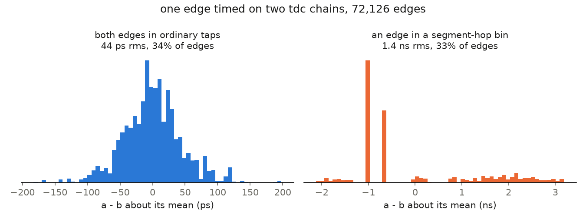

# ticprec

Single-shot precision of the gpsdo time interval counter, with no wiring.
The ring oscillator's edge goes into both TIC channels, channel B through
one kept LUT so yosys cannot fold the two identical carry chains into one
(2,562 ALUs in the build, both present). The true A to B time is a fixed
routing skew, so the spread of the measured one is the precision. Ring
edges land evenly over the clock period, so the same data calibrates each
chain by code density, with no GPS and no S1.

    make -C extras/ticprec flash
    timeout 120 cat /dev/ttyUSB1 > tic.txt
    python3 extras/ticprec/host/tic_prec.py tic.txt

One line per edge, `IIIIIIII AAA BBB`: the coarse interval (0 for the same
clock), fine A, fine B.

## Measured

72,126 edges in 120 s:

| Case | Share | Precision |
|---|---|---|
| ordinary taps on both chains | 34% | 43.7 ps rms pair, ~31 ps per channel |
| a segment hop bin | 33% | 1.4 ns rms |
| chain A saturated | 34% | lost |

- **Ordinary taps, 31 ps per channel.** The taps alone would give ~7 ps
  (25 ps / √12), so most of the 31 ps is real timing noise. Part of it is
  likely clock jitter: chain A samples one clock later than B, so the
  clock's cycle-to-cycle jitter lands in the difference.
- **Hop bins, 1.4 ns.** Where the carry crosses a fabric column one tap is
  4 to 6 ns wide, and an edge there is only known to that bin: 5 ns / √12 =
  1.44 ns. This is what wave union is for, since the hops land in different
  places in each chain.
- **Chain A saturates a third of the time.** It reads codes 800 to 1200
  where chain B reads 0 to 600, and piles up at 1200. Two attempts to
  detect the edge from the chain itself instead of the trigger net (from a
  raw tap, then from a latched snapshot bit) both hung on silicon while
  passing in simulation; the plain build on the same tree runs. An
  inverting cell at the head of chain A would explain both the codes and
  the hang. That is unconfirmed, so the design stays as it is.

## Wave Union from the Same Edges

tdc_wu sums the codes of chains that saw the same edge, which is exactly
A + B here: two chains placed wherever the placer liked. So the linearity
gain can be measured from this capture, on the 47,731 edges where A did not
saturate:

| | codes | mean bin | quantisation | widest bin |
|---|---|---|---|---|
| A alone | 400 | 61.3 ps | 913 ps | 6.1 ns |
| B alone | 401 | 61.1 ps | 778 ps | 4.8 ns |
| A + B | 800 | 30.6 ps | 575 ps | 4.3 ns |

Two chains halve the mean bin and take a quarter off the single-shot
quantisation. The wide bins only shrink where one chain's hop sits on the
other's fine taps; where both hop together a 4.3 ns bin is left, which is
why placing the chains so their hops interleave is the next step.
